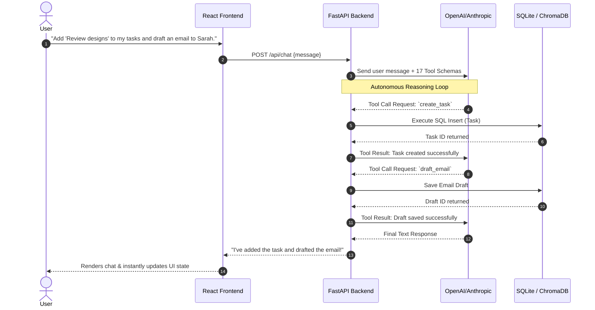
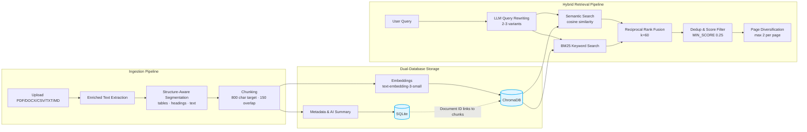
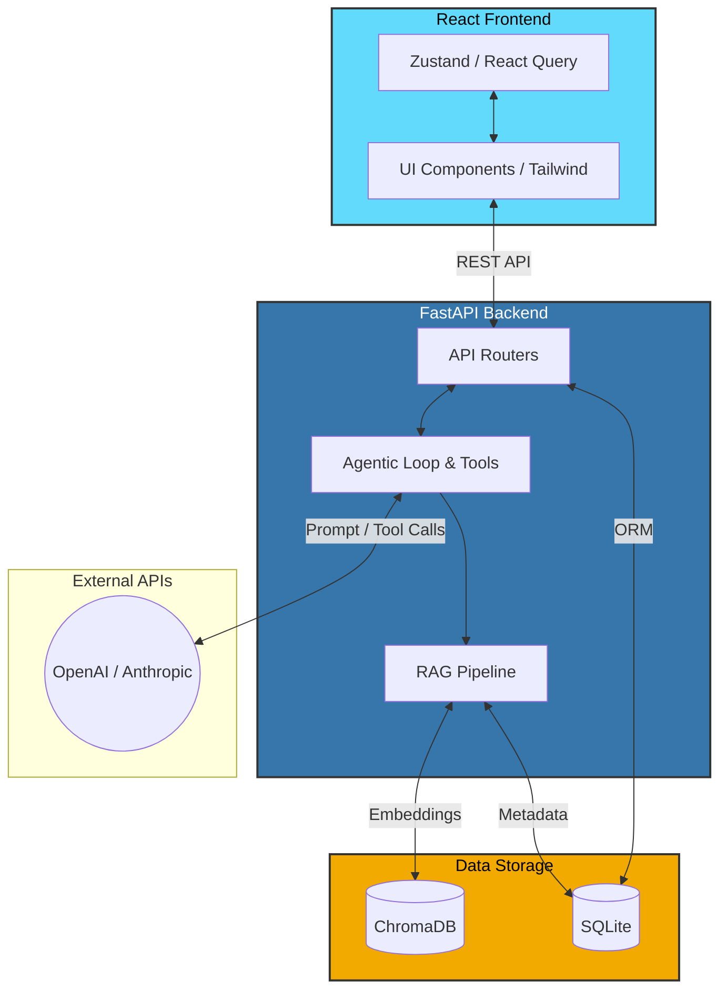

# TaskFlowAI

An AI-powered task management workspace with natural language chat, meeting notes extraction, document RAG search, calendar views, and project tracking. Built with FastAPI, React, and OpenAI/Anthropic APIs.

## Features

### Dual Mode Interface
- **Manual Mode** — Full task board with List and Calendar views, plus a floating AI chat widget
- **AI Chat Mode** — Full-page agentic chat with a compact sidebar for tasks, notes, emails, docs, and projects

### Task Management
- Create, edit, complete, and delete tasks with priority levels (low / medium / high) and optional deadlines
- Inline editing — click any task field to edit title, description, priority, or deadline
- Calendar view with day/week/month navigation and overdue highlighting

### AI Agent
- Natural language task management — create, update, and organize tasks through conversation
- **Morning Brief** — daily summary of overdue tasks, upcoming deadlines, active projects, and quick wins
- **Episodic Memory** — the agent remembers project history and user preferences across conversations
- **Ambiguity Resolution** — asks clarifying questions instead of guessing
- Supports both OpenAI and Anthropic as interchangeable providers



### Document Knowledge Base (RAG)
- Upload documents (TXT, DOCX, PDF, MD, CSV) up to 20 MB via drag-and-drop
- AI-generated summaries on upload
- **Structure-aware chunking** — tables, headings, and text are segmented separately; tables kept atomic (up to 1600 chars); headings stay attached to their first paragraph; fixed-size fallback (800 chars, 150 overlap) with chunks < 50 chars discarded
- **Enriched extraction** — PDF via PyMuPDF with font-size heading detection, table extraction, and OCR fallback; DOCX extracts paragraphs + tables; CSV converted to markdown tables
- **LLM query rewriting** — rewrites user queries into 2–3 search-optimized variants grounded in the document summary; short queries (≤ 4 words) skip rewriting
- **Hybrid search** — each query variant runs semantic search (OpenAI `text-embedding-3-small` / ChromaDB cosine) + BM25 keyword search in parallel
- **Reciprocal Rank Fusion (RRF)** — merges semantic and BM25 ranked lists per variant (k=60), then deduplicates across variants keeping the best score
- **Post-processing** — filters by cosine similarity (MIN_SCORE 0.25), diversifies results (max 2 per page to avoid dense-section bias), returns top-N
- **Faithfulness verification** — grounded generation with numbered inline citations `[1]`, `[2]`; post-streaming LLM check scores faithfulness (green/amber/red indicator in chat UI)



### Meeting Notes
- Paste or upload meeting notes for AI extraction
- Automatically identifies action items with priority and deadline inference
- One-click task creation from extracted candidates

### Email Drafting
- AI-powered email composition with revision workflow
- Draft management with copy-to-clipboard

### Projects & Profile
- Track projects with status (active / on-hold / completed) and episodic memory
- User profile that the AI learns and adapts to over time

### UI
- Dark and light theme with toggle (persisted to localStorage)
- Inter font, responsive layout, smooth transitions

## Architecture



## Tech Stack

| Layer | Technologies |
|-------|-------------|
| Frontend | React 18, TypeScript, Vite, Tailwind CSS, Zustand, React Query |
| Backend | FastAPI, SQLAlchemy, Pydantic, SQLite |
| AI | OpenAI / Anthropic (configurable), ChromaDB (vector store), BM25 |
| Documents | PyMuPDF, python-docx, pypdf |

## Getting Started

### Prerequisites
- Python 3.11+
- Node.js 18+
- An OpenAI or Anthropic API key

### Backend

```bash
cd backend
python -m venv .venv && source .venv/bin/activate
pip install -r requirements.txt
cp .env.example .env  # fill in your API keys
uvicorn app.main:app --reload --port 8000
```

### Frontend

```bash
cd frontend
npm install
npm run dev   # runs on http://localhost:5173
```

### Environment Variables

Copy `backend/.env.example` to `backend/.env` and configure:

```env
AI_PROVIDER=openai           # openai | anthropic
AI_MODEL=gpt-4o              # e.g. gpt-4o, claude-sonnet-4-6
OPENAI_API_KEY=sk-...
ANTHROPIC_API_KEY=sk-ant-...
DATABASE_URL=sqlite:///./taskflow.db
FRONTEND_URL=http://localhost:5173
```

### Health Check

```
GET http://localhost:8000/api/health
```

## Project Structure

```
TaskFlowAI/
├── backend/
│   ├── app/
│   │   ├── main.py            # FastAPI app + migrations
│   │   ├── config.py          # Pydantic settings
│   │   ├── database.py        # SQLAlchemy engine + session
│   │   ├── models.py          # ORM models
│   │   ├── schemas.py         # Request/response schemas
│   │   ├── ai/
│   │   │   ├── agent.py       # Agentic loop + system prompt
│   │   │   ├── tools.py       # 17 AI tools + dispatcher
│   │   │   ├── rag.py         # Document RAG pipeline
│   │   │   └── episodic.py    # Project + user memory
│   │   └── routers/           # 10 API routers
│   ├── requirements.txt
│   └── .env.example
│
└── frontend/
    ├── src/
    │   ├── App.tsx             # Layout, mode toggle, routing
    │   ├── components/         # UI components
    │   ├── hooks/              # Data fetching hooks
    │   ├── store/              # Zustand stores
    │   └── lib/                # API client + utilities
    ├── package.json
    └── tsconfig.json
```

## AI Tools

The agent has access to 17 tools:

| Tool | Description |
|------|-------------|
| `create_task` | Create a task with title, priority, and due date |
| `list_tasks` | List active or completed tasks with pagination |
| `update_task` | Update any task field |
| `delete_task` | Delete a task by ID |
| `complete_task` | Mark a task as complete |
| `draft_email` | Compose an email draft |
| `update_email_draft` | Revise an existing draft |
| `get_email_draft` | Retrieve a specific draft |
| `list_documents` | List uploaded documents with summaries |
| `search_documents` | RAG search across documents with citations |
| `update_user_profile` | Update profile fields |
| `list_projects` | List all projects |
| `create_project` | Create a new project |
| `log_project_event` | Log an episodic memory for a project |
| `recall_project_history` | Retrieve relevant project memories |
| `log_user_memory` | Store a user preference or fact |
| `recall_user_context` | Retrieve user memories by similarity |

## License

This project is licensed under the MIT License — see the [LICENSE](LICENSE) file for details.
